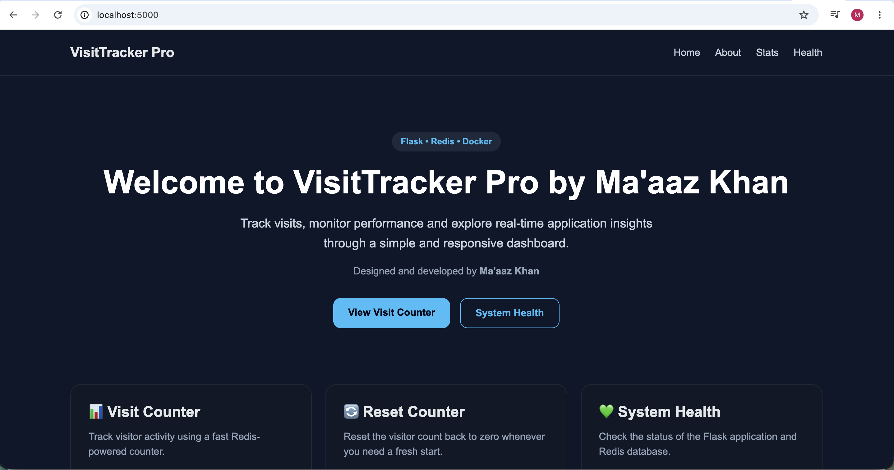
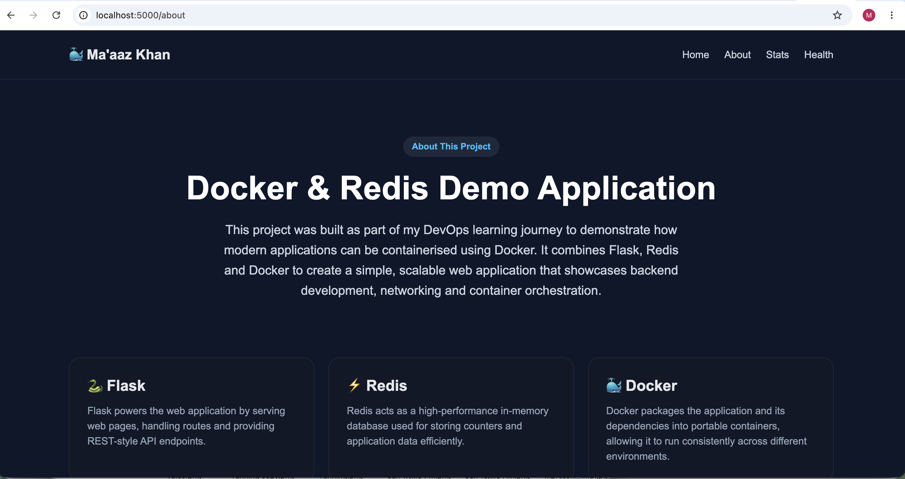
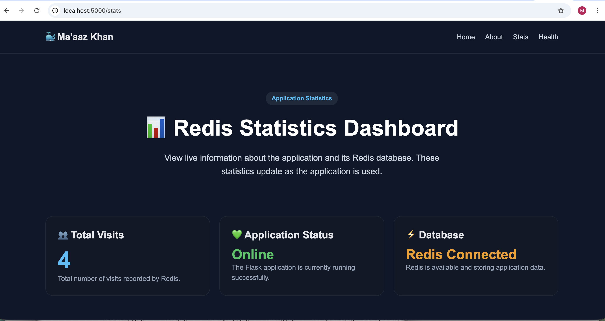
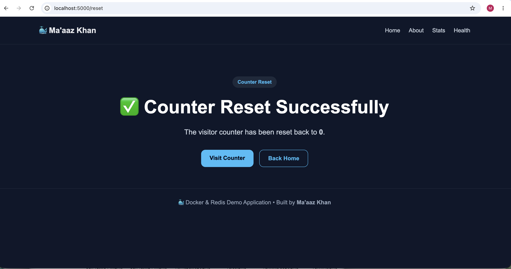
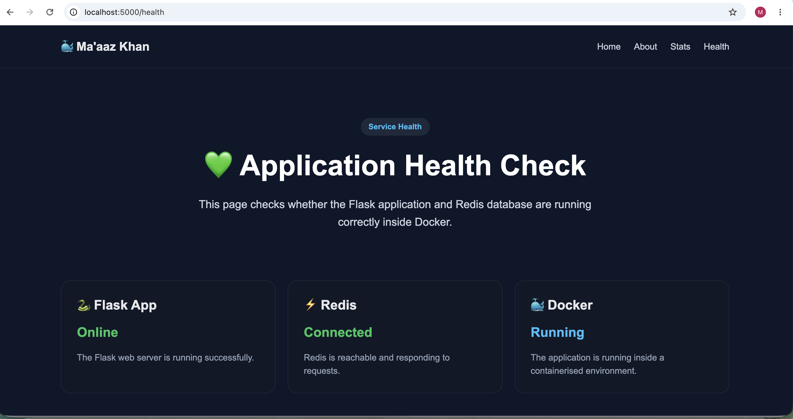
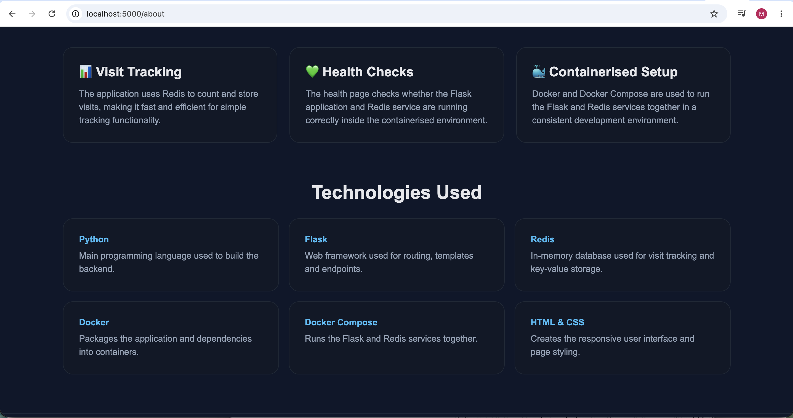

# 🐳 Flask + Redis Docker Application

A simple Flask web application containerised with Docker and powered by Redis. This project was built as part of my DevOps learning journey to gain hands-on experience with containerisation, web development, and Docker networking.

---

## 🚀 Features

- Flask web application
- Docker containerisation
- Redis integration
- Health check endpoint
- Visitor counter
- Counter reset functionality
- Statistics page
- Responsive HTML & CSS frontend

---

## 🛠️ Technologies Used

- Python
- Flask
- Docker
- Docker Compose
- Redis
- HTML
- CSS

---

## 📂 Project Structure

```
.
├── app.py
├── Dockerfile
├── docker-compose.yml
├── requirements.txt
├── templates/
│   ├── index.html
│   ├── about.html
│   ├── counter.html
│   ├── reset.html
│   ├── stats.html
│   └── health.html
├── static/
│   └── css/
│       └── style.css
└── README.md
```

---

## ⚙️ Installation

Clone the repository:

```bash
git clone https://github.com/YOUR_USERNAME/flask-redis.git
```

Move into the project directory:

```bash
cd flask-redis
```

---

## 🐳 Running with Docker Compose

Build and start the application:

```bash
docker compose up --build
```

The application will be available at:

```
http://localhost:5000
```

---

## 🌐 Available Endpoints

| Endpoint | Description |
|----------|-------------|
| `/` | Home page |
| `/about` | About page |
| `/count` | Increment visitor counter |
| `/reset` | Reset visitor counter |
| `/stats` | Application statistics |
| `/health` | Health check |

---

## 📸 Screenshots

Below are screenshots of the application, showcasing the user interface and key functionality built using Flask, Docker and Redis.

### 🏠 Home Page

The application's landing page, providing navigation to all available features and endpoints.



---

### 📖 About Page

Provides an overview of the project, explaining its purpose and the technologies used throughout the application.



---

### 📊 Statistics Page

Displays application statistics and information retrieved from Redis, giving an overview of the application's current state.



---

### 📈 Visitor Counter

Demonstrates the Redis-powered visitor counter, which automatically increments each time the page is accessed.


---

### 🔄 Reset Counter

Resets the visitor counter back to zero, allowing the application state to be refreshed for testing purposes.



---

### 💚 Health Check

Displays the application's health status by verifying that both the Flask web server and Redis service are running correctly.



---

### 🛠️ Technologies Used

Highlights the core technologies and tools used to develop and containerise the application.



---

## 📚 What I Learned

During this project I practised:

- Building Flask applications
- Creating Docker images
- Running containers
- Writing Dockerfiles
- Using Docker Compose
- Connecting multiple containers
- Working with Redis
- Building HTML templates
- Serving static CSS
- Creating REST endpoints
- Understanding container networking

---

## 🎯 Future Improvements

- Add a MySQL database
- User authentication
- Persistent Redis volumes
- CI/CD with GitHub Actions
- Deploy to AWS
- Add automated tests

---

## 👨‍💻 Author

**Ma'aaz Khan**

This project forms part of my journey towards becoming a DevOps Engineer.

