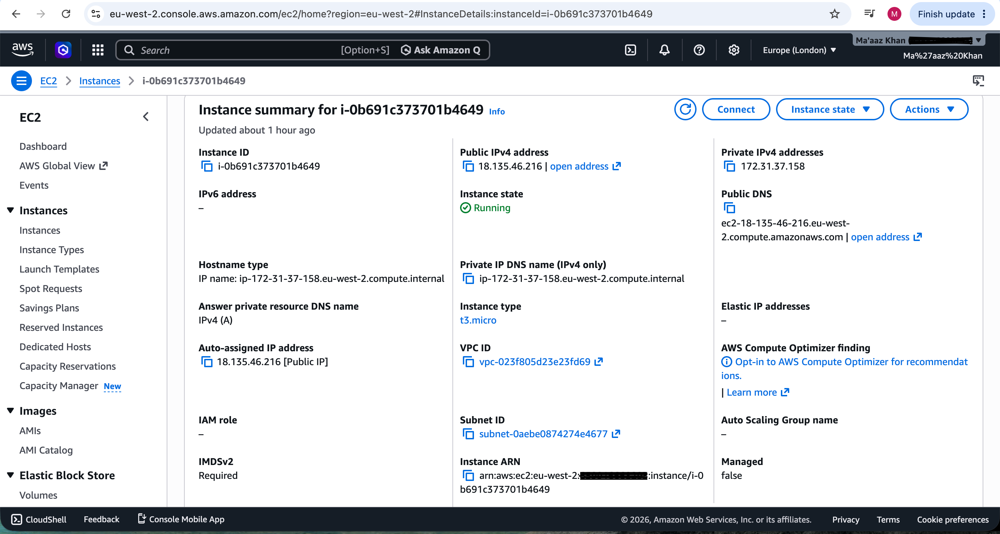
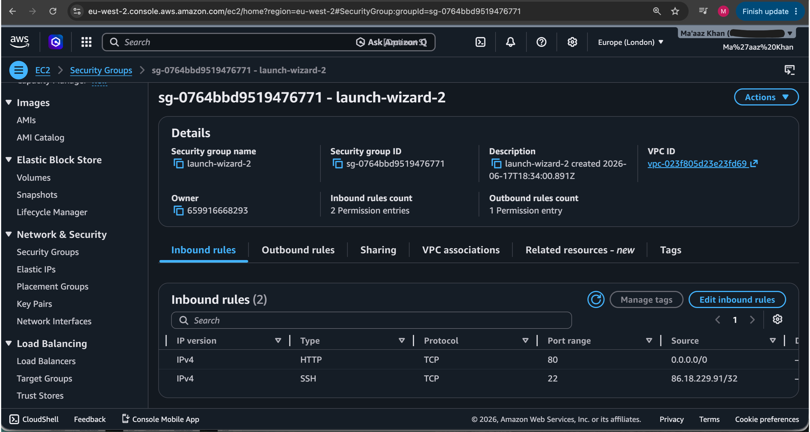
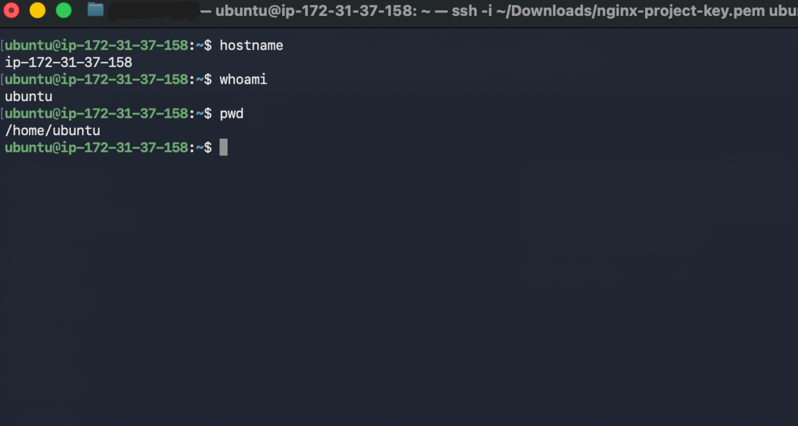
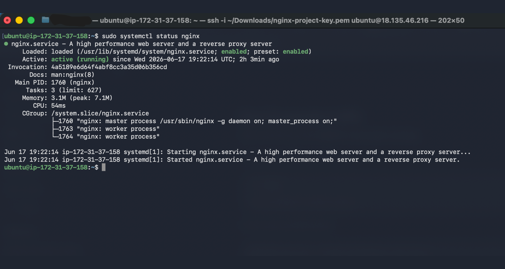
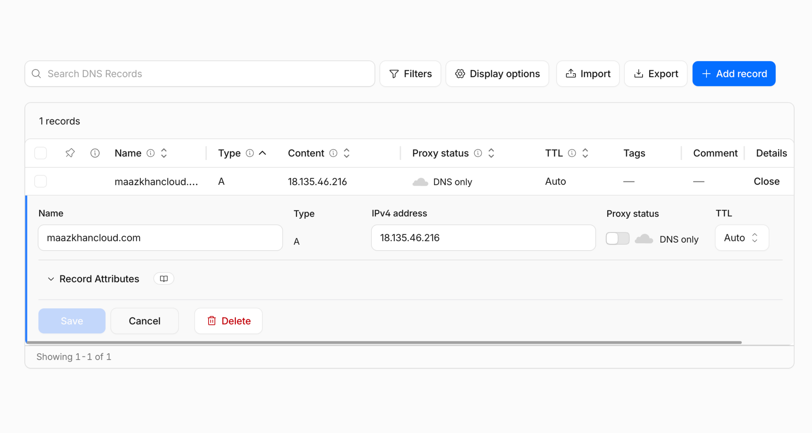
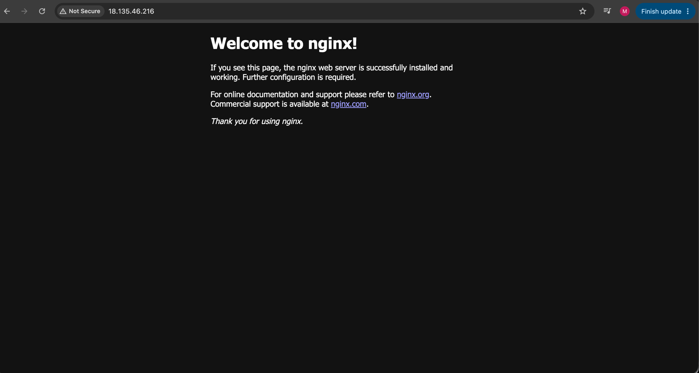

# 🌐 Deploying an NGINX Web Server on AWS EC2 with a Custom Domain

Deploying a production-style Linux web server on **AWS EC2**, configuring **NGINX**, and making it accessible through a **custom domain using Cloudflare DNS**.

---

# 📖 Overview

This project allowed me to apply several networking and cloud concepts together by deploying a web server on AWS and making it publicly accessible over the internet.

Instead of learning networking concepts individually, I wanted to understand how they work together in a real-world deployment.

By the end of this project I successfully:

- Launched an Ubuntu EC2 instance
- Connected securely using SSH
- Installed and configured NGINX
- Configured AWS Security Groups
- Connected my custom domain using Cloudflare DNS
- Accessed the server from anywhere using my own domain

---

# Architecture

```
                Internet
                    │
                    ▼
          maazkhancloud.com
                    │
                    ▼
           Cloudflare DNS
                    │
                    ▼
          EC2 Public IPv4 Address
                    │
                    ▼
      AWS Security Group (Port 80)
                    │
                    ▼
            Ubuntu EC2 Instance
                    │
                    ▼
                 NGINX
                    │
                    ▼
              Website Response
```

---

# Technologies Used

| Technology | Purpose |
|------------|---------|
| AWS EC2 | Cloud Virtual Machine |
| Ubuntu Server 24.04 LTS | Linux Operating System |
| NGINX | Web Server |
| Cloudflare DNS | Domain Name Management |
| SSH | Secure Remote Access |
| HTTP | Serve Web Pages |
| Linux | Server Administration |

---

# 🎯 Project Objectives

- Launch an Ubuntu EC2 Instance
- Generate an SSH Key Pair
- Connect securely to the server
- Install NGINX
- Start and enable the web server
- Configure Security Groups
- Point a custom domain to the EC2 instance
- Verify public access

---

# 📂 Project Structure

```
aws-ec2-nginx-web-server/

│
├── README.md
│
└── images/
    ├── ec2-instance-running.png
    ├── security-group-rules.png
    ├── ssh-connection.png
    ├── nginx-service-running.png
    ├── cloudflare-dns-record.png
    ├── nginx-welcome-ip.png
    └── domain-nginx-homepage.png
```

---

# 💻 Deployment Steps

## 1. Launch an EC2 Instance

- Ubuntu Server 24.04
- t3.micro
- Generated SSH Key Pair
- Enabled HTTP (80)
- Allowed SSH (22) from my own IP

### Screenshot



---

## 2. Configure Security Groups

Configured inbound rules to allow:

| Protocol | Port | Source |
|----------|------|--------|
| SSH | 22 | My Public IP |
| HTTP | 80 | Anywhere (0.0.0.0/0) |

### Screenshot



---

## 3. Connect Using SSH

Connected securely to the EC2 instance using the generated PEM key.

Commands used:

```bash
chmod 400 nginx-project-key.pem

ssh -i nginx-project-key.pem ubuntu@<EC2-Public-IP>
```

### Screenshot



---

## 4. Install NGINX

Updated package lists

```bash
sudo apt update
```

Installed NGINX

```bash
sudo apt install -y nginx
```

Started the service

```bash
sudo systemctl start nginx
```

Enabled NGINX on boot

```bash
sudo systemctl enable nginx
```

Verified the service

```bash
sudo systemctl status nginx
```

### Screenshot



---

## 5. Configure Cloudflare DNS

Created an **A Record** pointing my domain to the EC2 Public IPv4 address.

| Type | Name | Content |
|------|------|---------|
| A | @ | EC2 Public IPv4 |

### Screenshot



---

## 6. Verify Web Server

### Access using EC2 Public IP



---

### Access using Custom Domain

Successfully accessed the web server using:

```
http://maazkhancloud.com
```

### Screenshot


---

# 🧠 Networking Concepts Practised

This project helped reinforce several networking concepts including:

- DNS
- Public vs Private IP Addresses
- HTTP
- Linux Servers
- SSH Authentication
- AWS Security Groups
- Cloud Infrastructure
- NGINX
- Cloudflare DNS
- A Records

---

# 📚 What I Learned

This project helped me understand that visiting a website involves much more than simply typing a URL into a browser.

The request passes through several networking components before finally reaching the web server.

```
Browser
    │
    ▼
Cloudflare DNS
    │
    ▼
EC2 Public IP
    │
    ▼
AWS Security Group
    │
    ▼
HTTP Port 80
    │
    ▼
NGINX
    │
    ▼
Website
```

Seeing each stage working together made networking concepts much easier to understand than learning them individually.

---

# ⚠ Challenges

One issue I encountered was attempting to SSH into the EC2 instance from my Ubuntu virtual machine.

After troubleshooting, I realised my `.pem` private key had been downloaded onto my Mac rather than inside the virtual machine.

Connecting through the macOS Terminal solved the issue immediately and reinforced the importance of understanding where authentication credentials are stored.

---

# 🚀 Outcome

Successfully deployed an NGINX web server on AWS EC2 and connected it to my own custom domain using Cloudflare DNS.

This project gave me practical experience with:

- AWS
- Linux
- SSH
- NGINX
- DNS
- Cloudflare
- HTTP
- Security Groups
- Cloud Networking

---

# Future Improvements

Some ideas I'd like to explore next:

- Configure HTTPS using SSL/TLS
- Enable Cloudflare Proxy
- Deploy a custom HTML website
- Purchase an Elastic IP
- Configure automatic deployments with GitHub Actions
- Deploy using Infrastructure as Code (Terraform)

---
